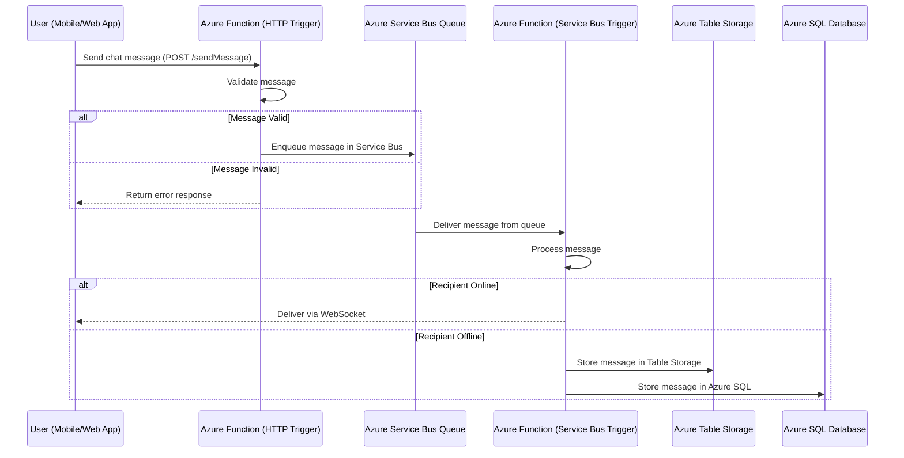

# ChatService


### **Detailed Expansion of Steps 1-5 in the Chat Messaging System**

This section provides an in-depth look at the first five steps of the chat messaging system, covering how a message is **ingested, processed, and stored** before being delivered to its intended recipient.

---

## **1. User Sends a Chat Message via the Client Application**
- The user initiates a message from a **mobile app** or **web application**.
- The front-end **constructs a JSON payload** containing:
  - `SenderID` (user who sent the message)
  - `ReceiverID` (intended recipient of the message)
  - `Timestamp` (when the message was sent)
  - `MessageText` (actual message content)
  - `AttachmentURL` (if applicable)
- This payload is then sent via an HTTP POST request to an **Azure Function (HTTP Trigger)**.
- The HTTP API endpoint might look like this:

```
POST https://chat-functions.azurewebsites.net/api/sendMessage
Content-Type: application/json
```

**Example Payload:**
```json
{
  "SenderID": "user123",
  "ReceiverID": "user456",
  "Timestamp": "2025-02-11T12:30:45Z",
  "MessageText": "Hey, how's it going?",
  "AttachmentURL": null
}
```

---

## **2. Azure Function (HTTP Trigger) Receives the Request**
- The **Azure Function (HTTP Trigger)** acts as the **entry point** for the chat system.
- It receives the JSON payload and **validates the message**:
  - Checks for empty or malformed requests.
  - Scans the message for spam or offensive content.
  - If an attachment is included, generates a **SAS URL** for secure upload to **Azure Blob Storage**.
- After validation, the function **logs the request** for observability in **Azure Monitor**.
- If the request passes validation, the function **forwards it to Azure Service Bus**.

```python
import azure.functions as func
import json
from azure.servicebus import ServiceBusClient, ServiceBusMessage

def main(req: func.HttpRequest) -> func.HttpResponse:
    req_body = req.get_json()
    
    sender = req_body.get("SenderID")
    receiver = req_body.get("ReceiverID")
    message = req_body.get("MessageText")
    timestamp = req_body.get("Timestamp")
    
    # Basic validation
    if not sender or not receiver or not message:
        return func.HttpResponse("Invalid request", status_code=400)
    
    # Publish message to Azure Service Bus
    servicebus_client = ServiceBusClient.from_connection_string("your_connection_string")
    sender_queue = servicebus_client.get_queue_sender(queue_name="chat-queue")
    
    chat_message = {
        "SenderID": sender,
        "ReceiverID": receiver,
        "MessageText": message,
        "Timestamp": timestamp
    }
    
    sender_queue.send_messages(ServiceBusMessage(json.dumps(chat_message)))
    
    return func.HttpResponse("Message sent successfully", status_code=200)
```

---

## **3. Message is Enqueued in Azure Service Bus**
- The **Azure Function enqueues the chat message** into an **Azure Service Bus Queue or Topic**.
- Service Bus ensures **asynchronous and durable message delivery**.
- **Why Service Bus?**
  - **Guaranteed delivery** even if the receiver is offline.
  - **Scalability**: Service Bus can handle millions of messages per second.
  - **Pub/Sub Support**: Can fan out messages to multiple recipients for group chats.

**Azure Service Bus Configuration:**
- **Queue Name:** `chat-queue`
- **Topic Name:** `chat-topic` (for group messaging)
- **Subscription:** `chat-subscription`

**Service Bus Message Structure:**
```json
{
  "SenderID": "user123",
  "ReceiverID": "user456",
  "MessageText": "Hey, how's it going?",
  "Timestamp": "2025-02-11T12:30:45Z"
}
```

---

## **4. Azure Function (Service Bus Trigger) Processes Messages**
- A **Service Bus-triggered Azure Function** continuously listens to the queue.
- When a message arrives, the function **processes and determines the recipient’s status**:
  - If **recipient is online**, the message is pushed to the client in real-time.
  - If **recipient is offline**, the message is persisted in **Azure SQL Database** or **Azure Table Storage**.

**Azure Function Code for Processing Messages:**
```python
import azure.functions as func
import json
from azure.data.tables import TableServiceClient

def main(msg: func.ServiceBusMessage):
    chat_data = json.loads(msg.get_body().decode('utf-8'))
    
    sender = chat_data["SenderID"]
    receiver = chat_data["ReceiverID"]
    message = chat_data["MessageText"]
    timestamp = chat_data["Timestamp"]

    # Check if the recipient is online (mock check)
    is_online = check_user_status(receiver)

    if is_online:
        send_to_websocket(receiver, chat_data)
    else:
        # Store message in Azure Table Storage
        save_message_to_table(sender, receiver, message, timestamp)

def save_message_to_table(sender, receiver, message, timestamp):
    table_service = TableServiceClient(account_url="https://yourstorageaccount.table.core.windows.net", credential="your_key")
    table_client = table_service.get_table_client(table_name="ChatMessages")

    entity = {
        "PartitionKey": receiver, 
        "RowKey": timestamp.replace(":", "-"),
        "SenderID": sender,
        "MessageText": message
    }
    table_client.upsert_entity(entity)
```

---

## **5. Message is Stored in Azure SQL or Azure Table Storage**
- If the recipient is offline, the message is stored for later retrieval.
- **Azure Table Storage** is used for fast retrieval of chat messages.
- **Azure SQL Database** is used if structured querying and relationships are needed.

### **Table Storage Schema**
| **PartitionKey (ReceiverID)** | **RowKey (Timestamp)** | **SenderID** | **MessageText** |
|---------------------|---------------------|----------|--------------|
| `user456` | `2025-02-11T12-30-45Z` | `user123` | `"Hey, how's it going?"` |

---

## **Mermaid Diagram for Steps 1-5**


---

## **Key Takeaways**
1. **Event-Driven Approach**: Azure Functions and Service Bus ensure high scalability.
2. **Asynchronous Processing**: Messages are enqueued and processed reliably.
3. **Storage Options**: Table Storage for NoSQL access, Azure SQL for structured queries.
4. **Real-Time Delivery**: WebSockets notify users instantly if they’re online.
5. **Offline Persistence**: Messages are stored for offline users and retrieved later.

Would you like further details on **WebSocket integration or message retrieval workflows**? 🚀
